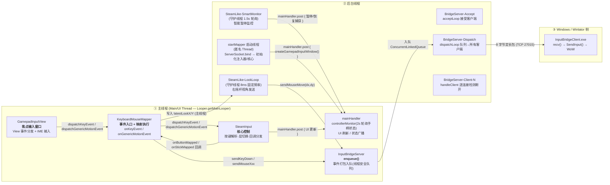
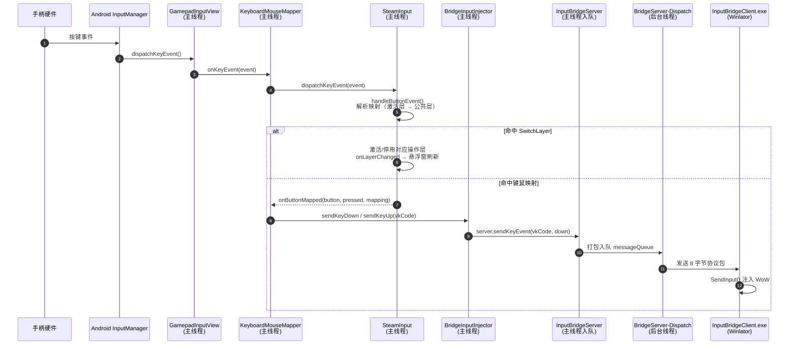
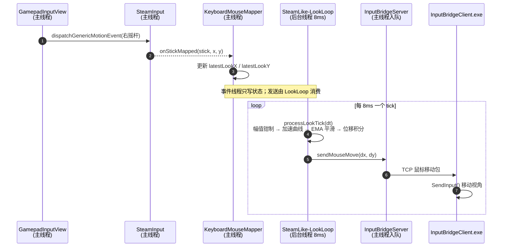
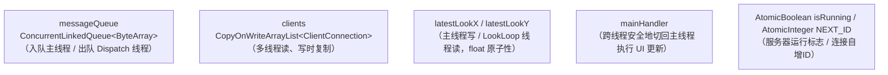
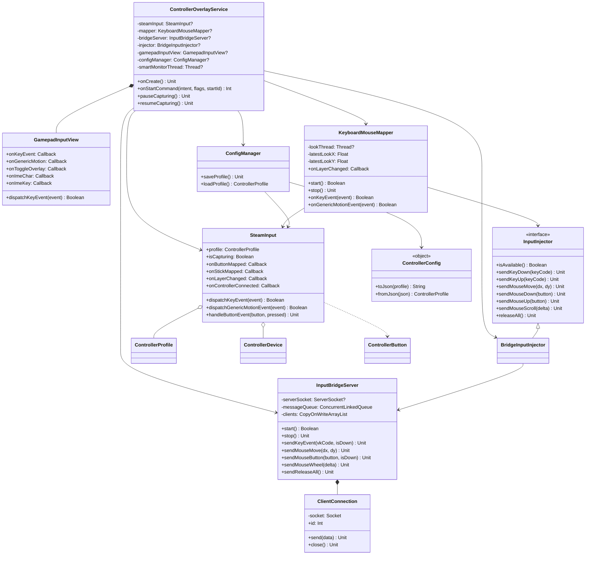
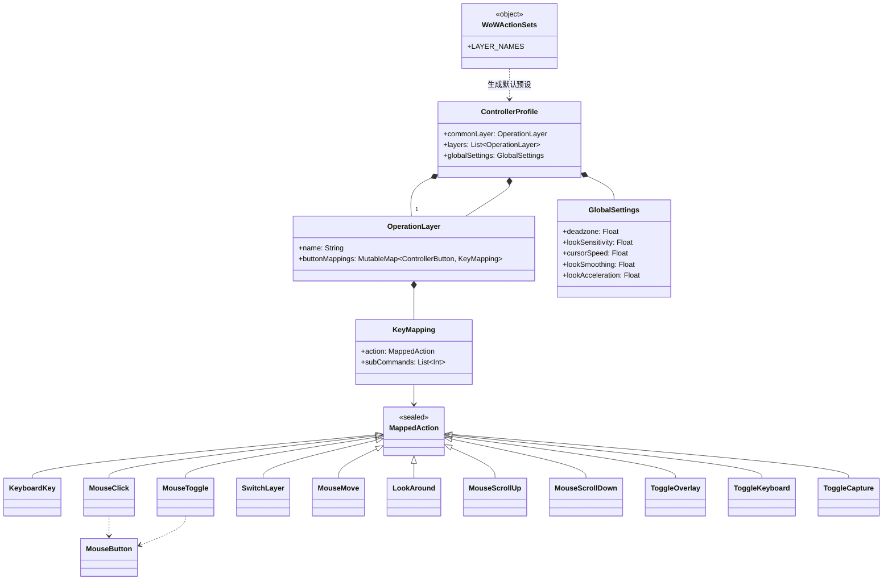
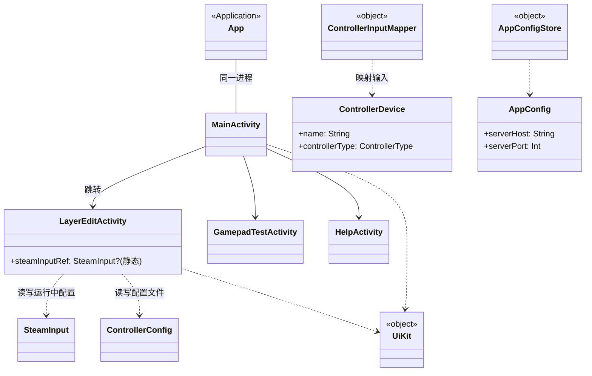

# SteamLike Controller — 线程模型与类图（UML）

> 本文档用 Mermaid 绘制本项目（Android 手柄映射桥接 App + Windows 注入程序）的线程模型与类图。
> 支持 Mermaid 的 Markdown 渲染器（VS Code、GitHub、Typora 等）可查看图表。

---

## 一、线程模型

### 1. 全局线程划分

**说明**：所有 View 事件、映射执行、注入器调用都在主线程完成；`InputBridgeServer` 的网络收发在独立后台线程；右摇杆视角用专用守护线程按 8ms 固定频率发送，保证包节奏均匀。

### 2. 按键事件流（按钮按下/释放）

### 3. 右摇杆视角流（事件 → 固定频率发送）

### 4. 关键线程同步手段

---

## 二、类图

### 1. 核心类关系

### 2. 数据模型（配置结构）

### 3. UI 层与辅助类

---

## 三、设计要点速览

- **层切换**：由公共层（Common）的 `SwitchLayer` 映射驱动，`OperationLayer` 无 `triggerButton` 字段；层编辑页「切入按键」读写公共层对应映射。
- **按键解析顺序**：激活层（按激活顺序）→ 公共层兜底。
- **右摇杆**：事件回调只写 `latestLookX/Y`，`SteamLike-LookLoop`（8ms）按实际 dt 积分发送，包节奏均匀不抖动。
- **TCP 协议**：8 字节定长包（键盘/鼠标移动/鼠标按钮/滚轮/释放全部/心跳），`TCP_NODELAY` 关闭 Nagle 防卡顿。
- **暂停捕获**：真正移除 1x1 焦点窗口以恢复系统返回手势；暂停后手柄事件无法到达 App，需悬浮窗按钮恢复。
- **IME 双输入防护**：仅 `CONTROL_KEY_CODES` 走按键事件通道，可打印字符只走文本通道，避免重复注入。
